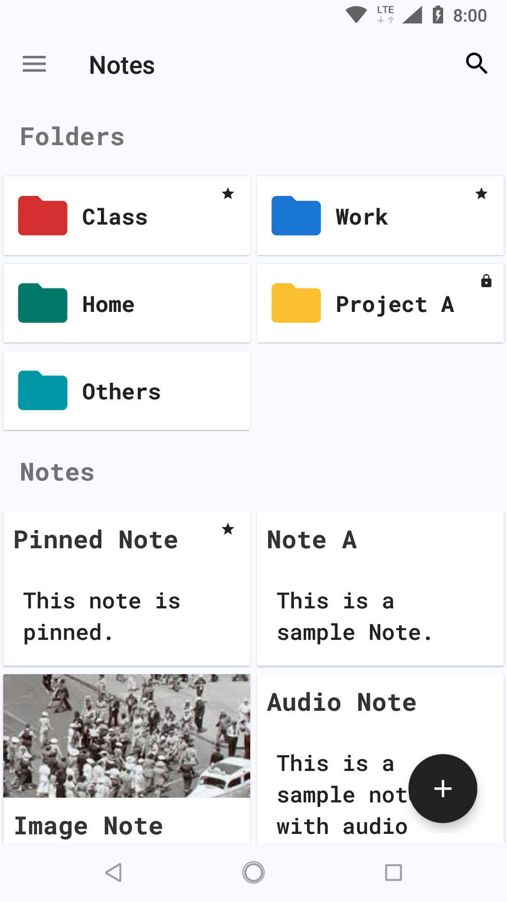
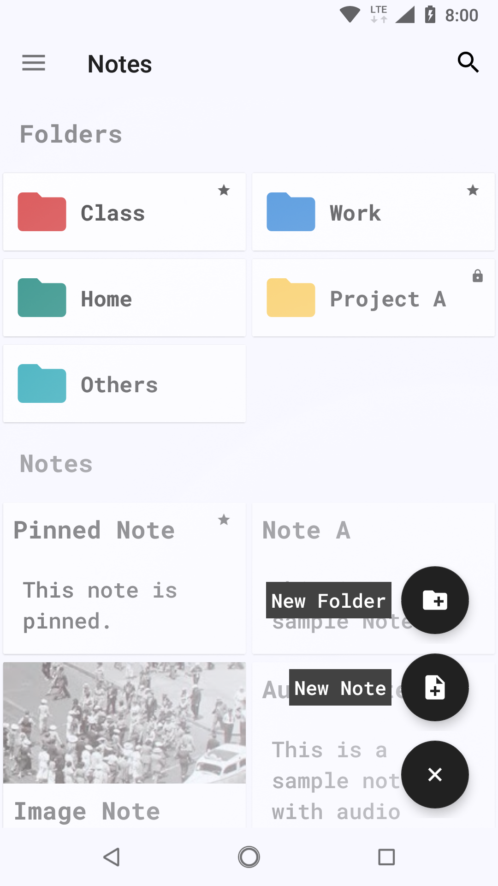
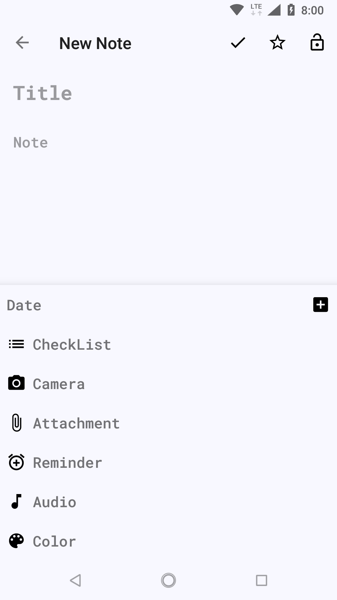

# Notes for Android

An Open source multimedia note taking application, build using new Android Jetpack.
Notes app is released as an alpha and is under heavy development.

### Introduction

Notes for android is build using new Android Jetpack libraries, it uses MVVM pattern and also uses Dagger and RxJava.
You can download the latest stable release from [Play Store](https://play.google.com/store/apps/details?id=com.nrs.nsnik.notes)

### Screenshots

### Getting Started

Clone this repository or Import the project using Android Studio.

## License

    Notes  Copyright (C) 2018  Nikhil Soni
    This program comes with ABSOLUTELY NO WARRANTY; for details type `show w'.
    This is free software, and you are welcome to redistribute it
    under certain conditions; type `show c' for details.

The hypothetical commands `show w' and `show c' should show the appropriate
parts of the General Public License.  Of course, your program's commands
might be different; for a GUI interface, you would use an "about box".

  You should also get your employer (if you work as a programmer) or school,
if any, to sign a "copyright disclaimer" for the program, if necessary.
For more information on this, and how to apply and follow the GNU GPL, see
<http://www.gnu.org/licenses/>.

  The GNU General Public License does not permit incorporating your program
into proprietary programs.  If your program is a subroutine library, you
may consider it more useful to permit linking proprietary applications with
the library.  If this is what you want to do, use the GNU Lesser General
Public License instead of this License.  But first, please read
<http://www.gnu.org/philosophy/why-not-lgpl.html>.
